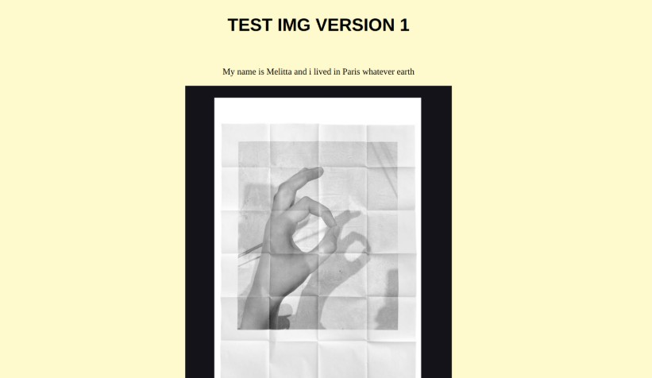
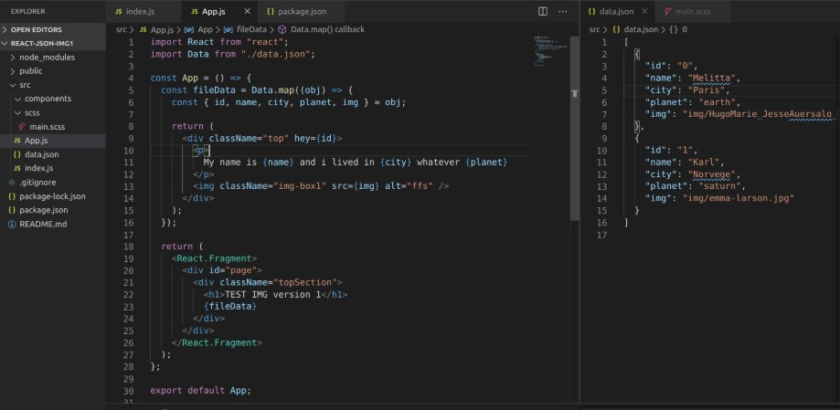

#### gallery intro

 The Goal of the tests in the versions, is  to analyse
the different kind of options i have and its respective difficulties, so
to choose what is simple when the time comes

## Beginner intro to json data (part1) | react

~~No copyright infringement intended, All pictures used in this exercise are **_only_** for educational purposes.~~

Version 1 

 

 Its still to early for me to  notice the "why" of the use of the long versions in certain projects like for example :

 

 

###### Click on the image to check the second version

